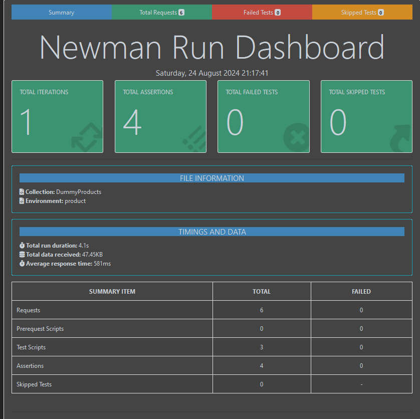

# API Testing on DummyJSON-Java
This repository contains a Java-based project for testing the DummyJSON API, a free and open-source REST API for testing and prototyping.

# Prerequisites
Before running the tests, ensure you have the following installed:

1. Java Development Kit (JDK): Version 8 or higher.
2. Apache Maven: For managing project dependencies.

# Setup
Clone the Repository:
`git clone https://github.com/Imratul/API-Testing-on-DummyJSON-Java.git`

Navigate to the Project Directory:
`cd API-Testing-on-DummyJSON-Java`

Install Dependencies:
`mvn clean install`

# Usage
1. Run Tests:
`mvn test`

2. View Test Reports:
After running the tests, reports will be generated in the target/surefire-reports directory.

# Test Report 

